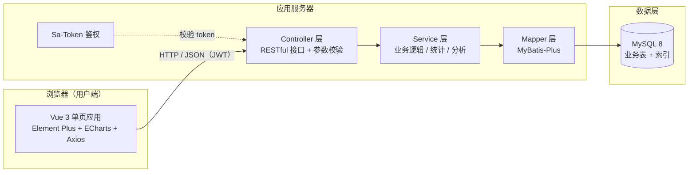
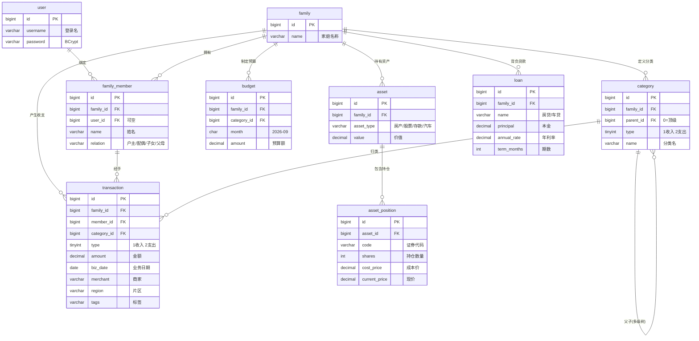

# 《管家婆─家庭收支管理系统》系统设计方案

| 项目 | 内容 |
|------|------|
| 文档名称 | 《管家婆─家庭收支管理系统》系统设计方案 |
| 适用课程 | 《软件开发实践2》——WEB 应用程序开发 |
| 文档版本 | v1.0 |
| 编写日期 | 2026-09-01 |
| 编写人 | 课程小组（成员及分工见第 12 章） |

---

## 目录

1. [项目概述](#1-项目概述)
2. [需求概述](#2-需求概述)
3. [技术选型](#3-技术选型)
4. [系统总体架构](#4-系统总体架构)
5. [数据库设计](#5-数据库设计)
6. [后端设计](#6-后端设计)
7. [前端设计](#7-前端设计)
8. [统计与分析功能设计](#8-统计与分析功能设计)
9. [拓展功能：家庭资产管理](#9-拓展功能家庭资产管理)
10. [测试方案](#10-测试方案)
11. [项目开发计划与小组分工](#11-项目开发计划与小组分工)
12. [风险与对策](#12-风险与对策)
13. [附录 A：参考开源项目调研](#13-附录-a参考开源项目调研)
14. [附录 B：项目目录结构与关键代码约定](#14-附录-b项目目录结构与关键代码约定)

---

## 1. 项目概述

### 1.1 项目背景

本项目为《软件开发实践2》课程实践作业，实践主题为 **WEB 应用程序开发**，系统名称（由老师拟定，不得变更）：**《管家婆─家庭收支管理系统》**。

系统面向"家庭"这一记账主体，提供家庭收入/支出的**录入、编辑、查询、统计、分析**全流程管理，并拓展**家庭资产管理**（房产、投资、股票、房/车贷款等）能力，帮助家庭了解收支状况、发现消费问题、优化财务决策。

### 1.2 建设目标

- **基本目标**：完成家庭收支的 CRUD（增删改查）+ 多维统计 + 基础分析；
- **进阶目标**：区分"统计"与"分析"，输出分析报告与异常预警；支持自定义多级收支分类；
- **拓展目标**：家庭资产管理（房产 / 投资 / 股票 / 贷款）；
- **工程目标**：以 4-5 人小组按软件工程流程（需求分析 → 设计方案 → 详细设计 → 编码 → 集成测试 → 演示答辩）完成开发，输出课程要求的全部提交物。

### 1.3 设计原则

1. **家庭为主体、成员为粒度**：收支数据的基本单位可以是整个家庭，也可以是某一家庭成员（录入时选择归属成员）；
2. **收支相对独立、可归总**：收入、支出分开管理与统计，同时支持归总形成"家庭收益情况"（结余 = 收入 − 支出）；
3. **分类可自定义**：采用多级树形分类，内置常用分类，允许用户自定义扩展；
4. **统计与分析分离**：统计 = 客观数据汇总（本月支出总额等）；分析 = 基于统计结果发现并解释问题（如"本月支出超出月均 30%，原因可能是……"）；
5. **录入时兼顾分析所需维度**：录入字段除金额、分类、日期外，还包含**经手成员、商家、片区、标签（如"礼尚往来"）、支付方式**等，为分析功能储备数据基础；
6. **参考不照搬**：功能参考支付宝/微信账单统计，但结合家庭场景与课程要求做差异化设计。

### 1.4 参考实现

- 支付宝 / 微信账单中的月度统计、分类占比、趋势图（参考 UI 与统计维度，不照搬）；
- 开源记账项目（见 [附录 A](#13-附录-a参考开源项目调研)）。

---

## 2. 需求概述

### 2.1 功能需求（编号清单）

| 编号 | 功能模块 | 需求描述 | 优先级 |
|------|----------|----------|--------|
| F1 | 用户注册 / 登录 | 账号密码注册登录，JWT 会话管理 | P0 |
| F2 | 家庭与成员管理 | 创建/加入家庭；维护家庭成员（户主、配偶、子女、父母），用于按成员统计 | P0 |
| F3 | 收支录入 | 记录收入/支出：金额、类型、分类、归属成员、日期、商家、片区、标签、备注、支付方式 | P0 |
| F4 | 收支查询 | 按时间范围、类型、分类、成员、关键词、商家、片区等多条件组合查询，分页展示 | P0 |
| F5 | 收支编辑 / 删除 | 修改、删除记录（逻辑删除），删除有确认与防误操作 | P0 |
| F6 | 分类管理 | 树形多级分类（收入/支出分离），内置常用分类，支持用户自定义增删改 | P0 |
| F7 | 收支统计 | 客观汇总：本月/本月结余、按分类汇总、按成员汇总、月度趋势、年度汇总 | P0 |
| F8 | 收支分析 | 环比/同比、超出月均预警、商家 Top N、片区分布、礼尚往来汇总、分析报告 | P1 |
| F9 | 资产管理（拓展） | 房产、股票/基金持仓、存款、汽车等资产录入与总资产统计 | P1 |
| F10 | 贷款管理（拓展） | 房贷/车贷信息管理，剩余本金、月供、还款计划测算 | P1 |
| F11 | 预算管理（拓展） | 按分类设置月度预算，展示执行率 | P2 |
| F12 | 数据导出 | 收支明细、统计结果导出 Excel/CSV | P2 |

> P0：基本功能（必修）；P1：拓展功能（选做加分）；P2：锦上添花。

### 2.2 非功能需求

| 类别 | 要求 |
|------|------|
| 性能 | 单家庭万级记录下，统计接口响应 < 2s（合理索引 + 聚合 SQL） |
| 安全 | 密码 BCrypt 加密存储；接口统一鉴权；防 SQL 注入（参数化查询）；金额 DECIMAL 精确计算 |
| 易用 | 界面简洁友好，移动端可基本适配（响应式布局） |
| 可维护 | 前后端分离，代码分层清晰，接口统一返回格式 |
| 可靠性 | 关键操作（删除）可恢复（逻辑删除）；数据库定时备份 |

---

## 3. 技术选型

### 3.1 开源项目调研参考

> 调研结果见 [附录 A](#13-附录-a参考开源项目调研)，此处给出调研结论：

- 国内外记账类开源项目成熟度很高，**主流组合为"现代前端框架（Vue/React）+ 后端框架（Spring Boot / Django / Node）+ 关系型数据库 + 图表库（ECharts）"**；
- 中文课程设计场景下，**Spring Boot + Vue 3 + MySQL** 生态最成熟、学习资料与参考代码最多；
- 统计图表**首选 ECharts**（课程推荐技术之一，中文文档完善，支付宝/微信账单同款视觉风格易实现）；
- 纯前端 localStorage 方案（如 Wallet App 类）实现简单，但无法支撑"家庭多人 + 分析"需求，**本项目不采用**。

### 3.2 候选方案对比

| 方案 | 后端 | 前端 | 数据库 | 优势 | 劣势 | 适合小组 |
|------|------|------|--------|------|------|----------|
| **A（推荐）** | Java 17 + Spring Boot 3 + MyBatis-Plus | Vue 3 + Element Plus + ECharts | MySQL 8 | 课程要求的 Java Web 主流路线，资料最多，答辩认可度高；组件化开发快 | 学习曲线中等 | 常规小组 |
| B | .NET 8 + EF Core | Vue 3 + Element Plus | MySQL / SQL Server | 课程允许的另一条路线，C# 语法友好 | 资料略少 | 熟悉 C# 的小组 |
| C（简化） | Spring Boot 2 + MyBatis | 原生 HTML + jQuery + ECharts | MySQL | 完全贴合课程技术清单，前端零框架门槛 | 页面复用差、后期维护难 | 前端薄弱小组 |
| D | Python FastAPI / Django | Vue 3 | MySQL / SQLite | 开发快、代码量少 | 与"JAVA/.NET"课程主线有偏差，答辩需额外解释 | 不建议首选 |

### 3.3 推荐技术栈（方案 A）

**后端（Java）**

| 技术 | 选型 | 说明 |
|------|------|------|
| JDK | 17（LTS） | 长期支持版 |
| 框架 | Spring Boot 3.x | 简化配置、内嵌 Tomcat、生态成熟 |
| ORM | MyBatis-Plus | 通用 CRUD + 分页插件，代码量少；国内课程设计事实标准 |
| 数据库 | MySQL 8.0 | 关系型，统计聚合 SQL 强项 |
| 认证 | Sa-Token（或 Spring Security + JWT） | 轻量、中文文档、上手快；课程项目推荐 Sa-Token |
| 校验 | spring-boot-starter-validation | 参数校验注解 |
| 文档 | knife4j（OpenAPI） | 接口文档自动生成，演示答辩利器 |
| 工具库 | Lombok、Hutool | 减少样板代码 |
| 构建 | Maven | 事实标准 |

**前端（Vue 3）**

| 技术 | 选型 | 说明 |
|------|------|------|
| 框架 | Vue 3（组合式 API）+ Vite | 构建快、现代写法 |
| UI 组件库 | Element Plus | 中文组件库，后台管理类页面开箱即用 |
| 图表 | ECharts 5 | 课程推荐，折线/饼图/柱状图/热力图齐全 |
| 状态管理 | Pinia | Vue 官方推荐 |
| 路由 | Vue Router 4 | 单页路由 + 登录守卫 |
| HTTP | Axios | 统一拦截器（token、错误提示） |
| 日期处理 | day.js | 轻量 |

**开发与协作工具**：IntelliJ IDEA / VS Code、Navicat / DBeaver（数据库）、Apifox / Postman（接口调试）、Git + Gitee（代码托管，国内访问快）、Draw.io / PlantUML（图表）。

### 3.4 选型理由（答辩要点）

1. **符合课程要求**：课程明确"基于 .NET 或 JAVA Web 等应用程序开发技术"，方案 A 即 Java Web 主线；
2. **前后端分离**：符合当前企业主流开发模式，答辩时架构清晰可讲；
3. **生态与资料**：Spring Boot + Vue 3 组合在中文社区（掘金、CSDN、B 站）教程海量，小组自学成本最低；
4. **图表能力**：ECharts 为课程点名技术，覆盖统计/分析全部可视化需求；
5. **可演进**：方案 A 的接口设计可平滑对接移动端（如后续做小程序版）。

### 3.5 备选说明

- 若小组整体熟悉 C#，可整体切到方案 B，**数据库与前端设计保持不变**，仅后端技术替换；
- 若时间紧张，可从前端降级到方案 C 的"原生 HTML + jQuery"（课程技术清单完全覆盖），后端不变。

---

## 4. 系统总体架构

### 4.1 架构图



**文字说明（架构图不可用时的兜底）**：浏览器中的 Vue 3 单页应用通过 HTTP/JSON 请求（携带 JWT 令牌）访问应用服务器的 RESTful 接口；请求先经 Sa-Token 鉴权拦截，通过后进入 Controller 层校验参数，再由 Service 层执行业务逻辑与统计/分析计算，经 Mapper 层（MyBatis-Plus）读写 MySQL 数据库。

### 4.2 分层职责

| 层 | 职责 | 对应技术 |
|----|------|----------|
| 展示层（前端 SPA） | 页面渲染、交互、图表、调用接口 | Vue 3 + Element Plus + ECharts |
| 接口层（Controller） | 接收请求、参数校验、统一返回 | Spring Boot + Validation |
| 业务层（Service） | 业务规则、统计汇总、分析预警 | Spring Service |
| 数据访问层（Mapper） | SQL 与 ORM 映射、分页 | MyBatis-Plus |
| 数据层 | 数据存储 | MySQL 8 |

### 4.3 部署拓扑（演示环境）

```
浏览器 ──HTTP──▶ Tomcat（内嵌，端口 8080，前后端打包同一工程或 Nginx 代理）
                       │
                       ▼
                   MySQL 8（本地，端口 3306）
```

- 开发期：Vite 开发服务器（5173 端口）代理 `/api` 到后端（8080）；
- 演示期：`npm run build` 将前端产物放入后端 `static` 目录（或 Nginx），单机即可完整演示。

---

## 5. 数据库设计

### 5.1 ER 图



### 5.2 表设计

统一约定：主键 `id` BIGINT 自增；含 `created_at`、`updated_at` DATETIME；删除采用逻辑删除（`deleted` TINYINT，0 正常 1 已删，MyBatis-Plus 自动处理）；金额一律 `DECIMAL(12,2)`。

#### 5.2.1 `user` 用户表（登录账号）

| 字段 | 类型 | 约束 | 说明 |
|------|------|------|------|
| id | BIGINT | PK, AUTO_INCREMENT | 主键 |
| username | VARCHAR(50) | UNIQUE, NOT NULL | 登录名 |
| password | VARCHAR(100) | NOT NULL | BCrypt 加密密文 |
| nickname | VARCHAR(50) | | 昵称 |
| avatar | VARCHAR(255) | | 头像地址 |
| role | VARCHAR(20) | 默认 'MEMBER' | ROLE_ADMIN（家庭管理员）/ ROLE_MEMBER |
| status | TINYINT | 默认 1 | 1 正常 0 禁用 |
| created_at / updated_at | DATETIME | | 创建/更新时间 |

#### 5.2.2 `family` 家庭表

| 字段 | 类型 | 约束 | 说明 |
|------|------|------|------|
| id | BIGINT | PK | 主键 |
| name | VARCHAR(50) | NOT NULL | 家庭名称（如"张三家"） |
| description | VARCHAR(255) | | 描述 |
| created_by | BIGINT | | 创建人 user.id |
| created_at / updated_at | DATETIME | | |

#### 5.2.3 `family_member` 家庭成员表

| 字段 | 类型 | 约束 | 说明 |
|------|------|------|------|
| id | BIGINT | PK | 主键 |
| family_id | BIGINT | FK→family, 索引 | 所属家庭 |
| user_id | BIGINT | FK→user, 可空 | 绑定账号（可为 NULL，表示仅作为家庭成员记账） |
| name | VARCHAR(50) | NOT NULL | 成员姓名/称呼 |
| relation | VARCHAR(20) | | 户主 / 配偶 / 子女 / 父母 / 其他 |
| birthday | DATE | | 出生日期（可选） |
| sort_order | INT | 默认 0 | 排序 |
| status | TINYINT | 默认 1 | 1 启用 0 停用 |

#### 5.2.4 `category` 收支分类表（多级树形、可自定义）

| 字段 | 类型 | 约束 | 说明 |
|------|------|------|------|
| id | BIGINT | PK | 主键 |
| family_id | BIGINT | FK→family, 索引 | 所属家庭（0 或系统级共享） |
| parent_id | BIGINT | 默认 0, 索引 | 父分类 id，0 = 顶级 |
| type | TINYINT | NOT NULL | 1 收入分类 / 2 支出分类 |
| name | VARCHAR(50) | NOT NULL | 分类名称（如"购物支出""服饰类"） |
| icon | VARCHAR(50) | | 图标标识（emoji 或 Element Plus 图标名） |
| sort_order | INT | 默认 0 | 排序 |
| is_system | TINYINT | 默认 0 | 1 系统内置（不可删除）/ 0 用户自定义 |
| status | TINYINT | 默认 1 | 1 启用 0 停用 |

**内置分类建议（家庭初始化时自动生成，用户可增改）**：

- 收入：工资奖金、经营收入、投资收益、礼金红包、其他收入
- 支出（一级 → 二级）：
  - 餐饮支出 → 在家做饭 / 外卖 / 外出就餐
  - 购物支出 → 服饰类 / 日用品类 / 电子产品类 / 其他购物
  - 交通支出 → 公共交通 / 打车 / 车辆用度（油费、停车）
  - 住房支出 → 房租 / 物业水电 / 装修维护
  - 医疗教育 → 医疗 / 教育 / 保险
  - 人情往来 → 礼尚往来 / 孝敬父母
  - 休闲娱乐、其他支出

> 多级树形（最多建议 3 级）既满足"购物支出可分为服饰类、日用品类"的课程要求，又保留用户自定义扩展能力。

#### 5.2.5 `transaction` 收支记录表（核心表）

| 字段 | 类型 | 约束 | 说明 |
|------|------|------|------|
| id | BIGINT | PK | 主键 |
| family_id | BIGINT | FK→family, 联合索引 | 所属家庭 |
| member_id | BIGINT | FK→family_member, 联合索引 | 经手成员（可为 NULL = 家庭整体） |
| type | TINYINT | NOT NULL, 联合索引 | 1 收入 / 2 支出 |
| category_id | BIGINT | FK→category, 联合索引 | 归属分类（叶子分类） |
| amount | DECIMAL(12,2) | NOT NULL | 金额（>0） |
| biz_date | DATE | NOT NULL, 联合索引 | 业务发生日期 |
| merchant | VARCHAR(100) | 索引 | 商家/对方（如"XX超市""美团外卖"） |
| region | VARCHAR(50) | 索引 | 消费片区（如"朝阳区望京"） |
| tags | VARCHAR(100) | | 逗号分隔标签，如"礼尚往来,生日" |
| payment_method | VARCHAR(20) | | 支付宝 / 微信 / 银行卡 / 现金 / 其他 |
| image | VARCHAR(255) | | 凭证图片地址（可选） |
| note | VARCHAR(255) | | 备注 |
| created_by | BIGINT | | 录入人 |
| deleted | TINYINT | 默认 0 | 逻辑删除 |
| created_at / updated_at | DATETIME | | |

**索引设计**：`(family_id, biz_date)`、`(family_id, type, category_id)`、`(family_id, member_id)` —— 覆盖查询与统计的主要分组维度。

> 设计说明：`merchant / region / tags` 三个字段直接对应课程要求⑤（外部餐饮商家、片区、礼尚往来消费）的统计来源；`member_id` 对应"以成员为基本单位"的粒度要求。

#### 5.2.6 `budget` 预算表（拓展）

| 字段 | 类型 | 约束 | 说明 |
|------|------|------|------|
| id | BIGINT | PK | 主键 |
| family_id | BIGINT | FK, 联合索引 | 所属家庭 |
| category_id | BIGINT | FK→category, 联合索引 | 预算分类（可为空=总预算） |
| budget_month | CHAR(7) | NOT NULL, 联合索引 | 预算月份 '2026-09' |
| amount | DECIMAL(12,2) | NOT NULL | 预算金额 |
| created_at / updated_at | DATETIME | | |

#### 5.2.7 `asset` 资产表（拓展）

| 字段 | 类型 | 约束 | 说明 |
|------|------|------|------|
| id | BIGINT | PK | 主键 |
| family_id | BIGINT | FK, 索引 | 所属家庭 |
| asset_type | VARCHAR(20) | NOT NULL | 房产 / 股票基金 / 存款 / 汽车 / 其他 |
| name | VARCHAR(100) | NOT NULL | 资产名称（如"XX小区 3 号楼 2 单元"） |
| value | DECIMAL(14,2) | NOT NULL | 当前估值 |
| purchase_date | DATE | | 购置日期 |
| note | VARCHAR(255) | | 备注 |
| created_at / updated_at | DATETIME | | |

#### 5.2.8 `asset_position` 股票/基金持仓表（拓展）

| 字段 | 类型 | 约束 | 说明 |
|------|------|------|------|
| id | BIGINT | PK | 主键 |
| asset_id | BIGINT | FK→asset, 索引 | 所属资产（asset_type=股票基金） |
| code | VARCHAR(20) | | 证券代码（如 600519） |
| name | VARCHAR(50) | | 证券名称 |
| shares | INT | NOT NULL | 持仓数量 |
| cost_price | DECIMAL(12,4) | | 成本价 |
| current_price | DECIMAL(12,4) | | 现价（可手工更新） |
| updated_at | DATETIME | | 估值更新时间 |

> 持仓市值 = shares × current_price，可计入总资产。

#### 5.2.9 `loan` 贷款表（拓展）

| 字段 | 类型 | 约束 | 说明 |
|------|------|------|------|
| id | BIGINT | PK | 主键 |
| family_id | BIGINT | FK, 索引 | 所属家庭 |
| name | VARCHAR(50) | NOT NULL | 贷款名称（房贷 / 车贷 / 消费贷） |
| principal | DECIMAL(14,2) | NOT NULL | 贷款本金 |
| annual_rate | DECIMAL(6,4) | | 年利率（如 0.0380） |
| term_months | INT | | 期数（月） |
| start_date | DATE | | 起贷日期 |
| repayment_type | VARCHAR(10) | 默认 'equal_installment' | 等额本息 equal_installment / 等额本金 equal_principal |
| monthly_payment | DECIMAL(14,2) | | 月供（等额本息固定；等额本金可算首月） |
| remaining_principal | DECIMAL(14,2) | | 剩余本金（可按月更新） |
| lender | VARCHAR(50) | | 贷款机构 |
| created_at / updated_at | DATETIME | | |

### 5.3 关键设计说明

1. **为什么用逻辑删除**：收支记录是个人财务数据，误删不可恢复，逻辑删除 + 回收站思路可保数据安全，且 MyBatis-Plus 内置支持；
2. **金额用 DECIMAL 不用 DOUBLE**：避免浮点误差，财务数据硬性要求；
3. **分类树实现**：`parent_id` 自引用即可，无需求闭包表（表结构简单优先）；查询时后端一次性返回整棵树，前端组织树形结构；
4. **成员与账号解耦**：`family_member.user_id` 可空——支持"本人给全家记账"（成员不登录）与"多人各自记账"两种模式，符合课程要求①；
5. **标签字段**：`tags` 以逗号分隔轻量实现（如"礼尚往来"），统计用 `FIND_IN_SET`/`LIKE` 聚合，避免单独建标签表增加复杂度（数据量大再拆表）。

### 5.4 统计查询 SQL 思路（供详细设计参考）

```sql
-- ① 月度收支汇总（统计）
SELECT type, SUM(amount) AS total
FROM `transaction`
WHERE family_id = ? AND deleted = 0
  AND biz_date BETWEEN '2026-09-01' AND '2026-09-30'
GROUP BY type;

-- ② 分类汇总（统计）：按月/年 × 分类，趋势图与饼图的数据源
SELECT t.category_id, c.name, c.type, SUM(t.amount) AS total
FROM `transaction` t
JOIN category c ON c.id = t.category_id
WHERE t.family_id = ? AND t.deleted = 0 AND t.biz_date BETWEEN ? AND ?
GROUP BY t.category_id, c.name, c.type
ORDER BY total DESC;

-- ③ 月度趋势（统计）：近 12 个月收支趋势
SELECT DATE_FORMAT(biz_date, '%Y-%m') AS month,
       SUM(CASE WHEN type = 1 THEN amount ELSE 0 END) AS income,
       SUM(CASE WHEN type = 2 THEN amount ELSE 0 END) AS expense
FROM `transaction`
WHERE family_id = ? AND deleted = 0 AND biz_date >= DATE_SUB(NOW(), INTERVAL 11 MONTH)
GROUP BY DATE_FORMAT(biz_date, '%Y-%m')
ORDER BY month;

-- ④ 商家 Top N（分析）：外部餐饮主要消费商家
SELECT merchant, SUM(amount) AS total, COUNT(*) AS cnt
FROM `transaction`
WHERE family_id = ? AND deleted = 0
  AND type = 2 AND category_id IN (餐饮分类及其子类)
  AND biz_date BETWEEN ? AND ?
GROUP BY merchant
ORDER BY total DESC
LIMIT 10;

-- ⑤ 片区分布（分析）：外部餐饮集中在哪个片区
SELECT region, SUM(amount) AS total, COUNT(*) AS cnt
FROM `transaction`
WHERE family_id = ? AND deleted = 0
  AND type = 2 AND category_id IN (餐饮分类及其子类)
  AND biz_date BETWEEN ? AND ?
GROUP BY region
ORDER BY total DESC;

-- ⑥ 礼尚往来汇总（分析）：朋友间礼尚往来消费
SELECT SUM(amount) AS total, COUNT(*) AS cnt
FROM `transaction`
WHERE family_id = ? AND deleted = 0
  AND FIND_IN_SET('礼尚往来', tags)
  AND biz_date BETWEEN ? AND ?;

-- ⑦ 月度异常预警（分析）：本月支出 vs 近 12 个月月均
-- 月均 = 近 12 个月（不含本月）支出总和 / 11，若本月超出 130% 则预警
```

---

## 6. 后端设计

### 6.1 技术栈

Java 17 + Spring Boot 3.x + MyBatis-Plus + MySQL 8 + Sa-Token + knife4j + Lombok/Hutool。

### 6.2 目录结构（后端工程）

```
family-finance-backend/
├── pom.xml
└── src/main/java/com/family/finance/
    ├── FinanceApplication.java        # 启动类
    ├── config/
    │   ├── SaTokenConfig.java         # 拦截器注册
    │   ├── MybatisPlusConfig.java     # 分页插件、自动填充
    │   └── WebConfig.java             # CORS、静态资源
    ├── common/
    │   ├── Result.java                # 统一返回 {code, message, data}
    │   ├── PageResult.java            # 分页返回
    │   ├── BizException.java          # 业务异常
    │   └── GlobalExceptionHandler.java# 全局异常处理
    ├── entity/                        # 数据库实体（User、Family、Member、
    │                                  #  Category、Transaction、Budget、Asset…）
    ├── mapper/                        # MyBatis-Plus Mapper 接口 + XML
    ├── dto/                           # 请求体（LoginDTO、TransactionDTO…）
    ├── vo/                            # 响应体（StatsVO、AnomalyVO…）
    ├── service/ + impl/               # 业务逻辑
    └── controller/                    # RESTful 接口
```

### 6.3 接口设计（RESTful，统一前缀 `/api`）

**认证与用户**

| 方法 | 路径 | 说明 |
|------|------|------|
| POST | /api/auth/login | 登录，返回 token |
| POST | /api/auth/register | 注册（同时创建家庭与户主成员） |
| GET | /api/auth/me | 当前用户信息 |
| PUT | /api/auth/password | 修改密码 |

**家庭与成员**

| 方法 | 路径 | 说明 |
|------|------|------|
| GET | /api/family | 当前家庭信息 |
| PUT | /api/family | 修改家庭 |
| GET | /api/members | 成员列表 |
| POST / PUT / DELETE | /api/members | 新增 / 修改 / 删除成员 |

**分类**

| 方法 | 路径 | 说明 |
|------|------|------|
| GET | /api/categories/tree?type=2 | 分类树（按收支类型） |
| POST / PUT / DELETE | /api/categories | 新增 / 修改 / 删除（内置分类禁删，有子分类/有流水禁删） |

**收支记录**

| 方法 | 路径 | 说明 |
|------|------|------|
| GET | /api/transactions?page=&size=&type=&categoryId=&memberId=&merchant=&region=&startDate=&endDate=&keyword= | 分页 + 多条件查询 |
| GET | /api/transactions/{id} | 详情 |
| POST / PUT / DELETE | /api/transactions | 新增 / 修改 / 删除（逻辑删除） |

**统计（客观汇总）**

| 方法 | 路径 | 说明 |
|------|------|------|
| GET | /api/stats/overview?year=&month= | 月度/年度收支汇总（收入、支出、结余、笔数） |
| GET | /api/stats/trend?months=12 | 月度趋势序列（收支、结余） |
| GET | /api/stats/category?year=&month=&type= | 分类汇总（饼图/柱状图数据） |
| GET | /api/stats/member?year=&month=&type= | 按成员汇总 |
| GET | /api/stats/merchant?year=&month=&categoryId= | 商家 Top N |
| GET | /api/stats/region?year=&month=&categoryId= | 片区分布 |
| GET | /api/stats/tags?year=&month=&tag= | 标签汇总（如礼尚往来） |

**分析（发现问题）**

| 方法 | 路径 | 说明 |
|------|------|------|
| GET | /api/analysis/compare?month= | 环比（vs 上月）、同比（vs 去年同月） |
| GET | /api/analysis/anomalies?month= | 异常预警列表（超月均 30%、超预算等） |
| GET | /api/analysis/report?month= | 一键生成月度分析报告（文本，含原因推测） |

**资产管理（拓展）**

| 方法 | 路径 | 说明 |
|------|------|------|
| GET | /api/assets | 资产列表（含持仓明细） |
| GET | /api/assets/summary | 资产汇总（总资产、按类型分布） |
| POST / PUT / DELETE | /api/assets | 增删改资产 |
| PUT | /api/assets/positions/{id}/price | 更新持仓现价 |
| GET | /api/loans | 贷款列表 |
| GET | /api/loans/{id}/plan | 还款计划测算（等额本息/本金公式） |
| POST / PUT / DELETE | /api/loans | 增删改贷款 |

**预算（拓展）**

| 方法 | 路径 | 说明 |
|------|------|------|
| GET | /api/budgets?month= | 预算列表 |
| GET | /api/budgets/execution?month= | 预算执行率 |
| POST / PUT / DELETE | /api/budgets | 增删改预算 |

**统一返回格式**：

```json
{ "code": 200, "message": "success", "data": { } }
```

分页返回：`{ "records": [], "total": 128, "current": 1, "size": 10 }`。

### 6.4 认证与权限设计

- 登录成功签发 token（Sa-Token），前端存入 localStorage，Axios 拦截器自动附带 `Authorization` 头；
- 后端拦截器校验 token，并将当前用户上下文（`StpUtil.getLoginId()`）注入；
- 家庭数据隔离：Service 层从 token 取 `family_id`，所有查询强制带上 `family_id` 条件（防止越权访问他家庭数据）；
- 管理员（户主）可管理成员、删除他人记录；普通成员仅操作自己的记录（`created_by` 校验）。

### 6.5 统计与分析实现方案

- **统计**：全部走聚合 SQL（见 5.4），`StatsService` 按维度组织，返回 `StatsVO`；接口为纯读，无状态、可缓存（数据量小可暂不做 Redis）；
- **分析**：`AnalysisService` 组合统计结果 + 规则引擎（简单 if-else 规则表），产出：
  - `AnomalyVO`：{ 类型, 维度, 本月值, 对比基准, 超幅, 建议 }；
  - `ReportVO`：文本化的月度分析报告，可直接展示。
- **规则示例（见第 8 章）**：超月均 30% 预警、预算超支预警、连续 3 个月增长预警。

---

## 7. 前端设计

### 7.1 技术栈

Vue 3（组合式 API）+ Vite + Vue Router 4 + Pinia + Element Plus + ECharts 5 + Axios + day.js。

### 7.2 页面结构

```
/login                       登录页
/register                    注册页
/（Layout 布局：侧边栏 + 顶栏 + 内容区，登录后）
├── /dashboard               首页仪表盘
├── /transactions            收支管理（列表 + 筛选 + 弹窗录入/编辑）
├── /categories              分类管理（树形表格）
├── /members                 成员管理
├── /analysis                统计分析（图表 + 分析报告 + 预警列表）
├── /assets                  资产管理（资产/持仓/贷款 + 汇总）
├── /budgets                 预算管理
└── /profile                 个人中心
```

### 7.3 页面功能明细

| 页面 | 核心内容 | 关键交互 |
|------|----------|----------|
| 登录/注册 | 表单 | 注册即创建家庭与户主 |
| 首页仪表盘 | 本月收支结余卡片 × 3、近 6 月收支趋势折线图、分类占比饼图、最近 10 笔流水、本月预警摘要 | 点击卡片跳转对应模块 |
| 收支管理 | 表格：日期/类型/分类/金额/成员/商家/片区/标签/备注；顶部筛选栏（时间、类型、分类、成员、关键词） | 新增/编辑用对话框表单；删除二次确认；支持批量删除 |
| 分类管理 | 树形表格展示收入/支出分类，Tab 切换 | 新增子分类、编辑、删除（含权限校验） |
| 成员管理 | 成员卡片/表格 | 增删改、设户主 |
| 统计分析 | 上：指标卡（环比/同比）；中：趋势折线图、分类占比环形图、分类柱状图；下：商家 Top N 排行、片区分布、礼尚往来汇总；右侧：异常预警列表 | 时间范围切换（本月/本年/自定义）；点击预警可钻取到流水 |
| 资产管理 | 资产汇总卡（总资产/按类型分布）+ 资产表格 + 持仓表格 + 贷款表格 | 持仓现价更新弹窗；贷款还款计划测算 |
| 预算管理 | 分类预算设置表 + 执行率进度条 | 超额标红 |
| 个人中心 | 昵称、头像、修改密码 | |

### 7.4 关键组件设计

| 组件 | 说明 |
|------|------|
| `StatCard.vue` | 统计指标卡（标题、数值、环比箭头） |
| `CategoryTree.vue` | 分类树选择器（表单内级联选择叶子分类） |
| `TransactionForm.vue` | 收支录入/编辑表单（类型切换、分类级联、成员下拉、标签多选） |
| `ChartBox.vue` | 图表容器封装（统一 loading、空数据、主题） |
| `PieChart / LineChart / BarChart.vue` | ECharts 封装（props 传 option，组件卸载时 dispose） |
| `DateRangePicker.vue` | 快捷时间范围（本月/上月/本年/自定义） |
| `AnomalyList.vue` | 预警列表（类型图标 + 说明 + 钻取） |
| `FileExport.vue` | 导出 Excel/CSV 按钮（后端生成或前端 js 生成） |

### 7.5 状态管理与请求封装

- **Pinia**：`userStore`（token、用户信息）、`familyStore`（当前家庭与成员列表，供全站下拉使用）；
- **Axios 拦截器**：请求附带 token；响应统一处理 `code != 200` 的错误提示与 401 跳登录；
- **路由守卫**：未登录访问拦截到 /login；已登录访问 /login 重定向到 /dashboard。

### 7.6 ECharts 图表方案

| 图表 | 用途 | 类型 |
|------|------|------|
| 折线图 | 月度收支趋势、结余趋势 | line（面积图渐变） |
| 饼图/环形图 | 分类占比、支付方式占比、资产类型分布 | pie |
| 柱状图 | 分类金额对比、成员对比、商家 Top N | bar |
| 条形图（横向） | 片区分布 | bar（horizontal） |
| 进度条/仪表盘 | 预算执行率 | 自定义组件即可（非必用仪表盘） |

> 答辩亮点：图表支持时间范围联动、hover tooltip 显示明细、点击柱状图下钻到流水列表（与 `/api/transactions` 查询联动）。

---

## 8. 统计与分析功能设计

本系统严格区分"统计"与"分析"（课程要求④），设计如下：

### 8.1 统计（客观数据汇总）

| 维度 | 指标 | 说明 |
|------|------|------|
| 时间 | 月度/年度/自定义区间 | 收入合计、支出合计、结余、笔数、日均支出 |
| 分类 | 一级/二级分类 | 各分类金额、占比、笔数 |
| 成员 | 家庭成员 | 各成员收支、占比 |
| 商家 | Top N | 外部餐饮主要消费商家、频次 |
| 片区 | 分布 | 外部餐饮集中片区（环形/条形图） |
| 标签 | 礼尚往来等 | 年度礼尚往来总支出 |
| 资产 | 汇总 | 总资产、总贷款、净资产（资产 − 贷款） |

### 8.2 分析（发现问题并解释）

| 分析项 | 规则 | 输出 |
|--------|------|------|
| 月度异常支出 | 本月支出 > 近 12 个月月均 × 130% | 预警：超幅、对应分类、可能原因 |
| 分类异常波动 | 某分类本月 > 该类月均 × 150%，且绝对差 > 200 元 | 预警 + 钻取该分类流水 |
| 预算超支 | 实际支出 > 预算金额 | 预警 + 执行率 |
| 连续增长 | 支出连续 3 个月环比增长 | 趋势预警 |
| 收入结构 | 收入来源过于集中（单分类 > 80%） | 提示分散风险 |
| 外部餐饮专项 | 商家 Top N + 片区分布 + 年度总额 | 分析卡片："主要消费在 XX 商家（占餐饮支出 XX%）" |
| 人情往来专项 | 礼尚往来年度总额、笔数、占比 | 分析卡片 |
| 月度分析报告 | 汇总以上规则，生成一段可读文本 | 报告卡片（可导出） |

**示例输出**（答辩演示用）：

> 📊 2026 年 8 月分析报告：
> 本月支出 12,600 元，超出近 12 个月月均（9,600 元）**31%**。主要增长来自"餐饮—外出就餐"（4,200 元，月均 1,800 元），其中 68% 消费于"XX 商圈"片区，主要商家为"XX 火锅店"（2,600 元）。结合上月同期数据（1,900 元），初步判断为暑期家庭聚餐集中所致，属季节性波动；若 9 月仍维持该水平，建议对"外出就餐"设置月度预算上限。

### 8.3 分析功能的落地方式

- 分析规则以 Service 内独立类（`AnalysisRules`）实现，规则可增删、可解释，答辩时可现场演示"改规则 → 重新生成报告"；
- 所有分析数据可一键钻取到对应流水列表（前端跳转 /transactions 并带筛选参数）。

---

## 9. 拓展功能：家庭资产管理

### 9.1 功能范围

| 资产类型 | 录入要素 | 计算 |
|----------|----------|------|
| 房产 | 名称、估值、购置日期 | 计入总资产 |
| 股票/基金 | 持仓：代码、名称、数量、成本价、现价 | 市值 = 数量 × 现价，更新现价联动总资产 |
| 存款/现金 | 名称、余额 | 计入总资产 |
| 汽车/其他 | 名称、估值 | 计入总资产 |
| 贷款（房贷/车贷） | 本金、年利率、期数、月供、剩余本金 | 还款计划测算；净资产 = 总资产 − 总贷款 |

### 9.2 还款计划测算（等额本息）

```
月利率 r = 年利率 / 12
月供   M = 本金 × r × (1+r)^期数 / ((1+r)^期数 − 1)
```

`/api/loans/{id}/plan` 返回逐月 [期次、本金、利息、剩余本金] 列表，前端表格展示 + 折线图（剩余本金递减曲线）。

### 9.3 与收支的联动（加分项）

- "投资收益""礼金红包"等收入分类的流水可**关联**资产对象（如股票分红计入对应持仓资产，`transaction.asset_id` 可空字段）；
- 首页净资产卡片 = 总资产 − 总贷款。

---

## 10. 测试方案

| 测试级别 | 内容 | 工具 | 覆盖重点 |
|----------|------|------|----------|
| 单元测试 | Service 层规则、工具类 | JUnit 5 + Mockito | 分析规则边界、金额计算、分类树组装 |
| 接口测试 | 全部 RESTful 接口 | Apifox / Postman | 参数校验、鉴权拦截、CRUD 主流程、统计 SQL 正确性 |
| 集成测试 | 前后端联调 | 手工 + Playwright（可选） | 登录→录入→查询→统计→分析全链路 |
| 回归测试 | 修改后验证 | 手工 + 接口用例集 | 分类增删对历史流水的影响 |
| 性能验证 | 万级流水统计响应 | JMetter（可选） | 统计接口 < 2s |

**关键测试用例示例**：

1. 金额输入 0 / 负数 / 超大数 → 校验拒绝；
2. 删除有子分类的父分类 → 拒绝并提示；
3. 删除已挂流水的分类 → 拒绝并提示先迁移流水；
4. 未登录访问任何业务接口 → 401；
5. 跨家庭访问数据（改 family_id）→ 只返回本家庭数据；
6. 超出月均 130% 规则 → 正确生成预警与钻取参数；
7. 等额本息测算：本金 100 万、年利率 3.8%、30 年 → 月供与银行计算器结果一致（约 4,659 元）。

---

## 11. 项目开发计划与小组分工

### 11.1 阶段计划（对照课程提交物）

| 阶段 | 周期 | 产出（对应提交物） | 里程碑 |
|------|------|--------------------|--------|
| 需求分析 | 第 1 周 | 需求规格说明书、用例图、课程思政报告（融入部分） | 需求评审 |
| 设计方案 | 第 1-2 周 | **本文档**（技术选型、架构、数据库、前后端设计） | 方案评审 |
| 详细设计 | 第 2-3 周 | 接口文档（knife4j/Apifox）、数据库 DDL、类图/时序图 | DDL 评审 |
| 编码实现 | 第 3-6 周 | 前后端代码、数据库脚本 | 每周末迭代演示 |
| 集成测试 | 第 6-7 周 | 测试用例、测试报告、实施日报 | 测试评审 |
| 系统实施 | 第 7-8 周 | 演示环境、演示数据、PPT、答辩 | 作品演示与答辩 |

> 课程要求的**项目计划、项目实施日报**在整个过程中持续更新（建议组长用飞书/石墨共享表格记录每日进展）。

### 11.2 小组分工建议（5 人）

| 角色 | 人员 | 职责 |
|------|------|------|
| 组长（项目管控） | 成员 A | 进度与风险管理、总体设计、数据库设计、答辩统筹 |
| 后端开发 1 | 成员 B | 认证、家庭成员、分类、收支 CRUD 接口 |
| 后端开发 2 | 成员 C | 统计、分析、资产、贷款接口 |
| 前端开发 | 成员 D | 全部页面与组件、ECharts 图表、联调 |
| 测试与文档 | 成员 E | 测试用例与执行、实施日报、课程思政报告、文档整合 |

> 4 人小组：合并"测试与文档"职责到组长与后端开发 2，或让前端承担部分测试。

### 11.3 Git 协作规范

- Gitee 建私有仓库，分支策略：`main`（稳定）+ `feature/*`（功能分支）+ `dev`（集成）；
- 提交信息格式：`feat: 新增收支录入` / `fix: 修复统计时间边界` / `docs: 更新接口文档`；
- 每周五集成一次，避免"最后一星期合代码"。

---

## 12. 风险与对策

| 风险 | 影响 | 对策 |
|------|------|------|
| 小组成员前端经验不足，Vue 3 学习成本高 | 进度延误 | 先用 Element Plus 官方模板起步；必要时降级为原生 HTML+jQuery（方案 C） |
| 多人并发修改冲突 | 代码混乱 | Git 分支管理 + 每周集成；模块按"一人一个领域"划分避免冲突 |
| 统计 SQL 复杂出错 | 数据不准确 | 先用内置数据集验证 SQL；接口测试用例覆盖统计结果 |
| 分析功能做不出来"分析感" | 答辩扣分 | 先实现"超月均 30% 预警 + 月度报告"两个核心规则，规则可解释可演示 |
| 演示数据缺乏真实感 | 演示效果差 | 预置一套"真实感"演示数据（近 12 个月、多成员、多分类、商家片区完整） |
| 答辩被问"为什么这样设计" | 答不上来 | 本文档即答辩底稿，重点准备：技术选型理由、分类树设计、统计与分析区分、多因素字段设计 |

---

## 13. 附录 A：参考开源项目调研

> 调研日期：2026-09-01。star 数、许可证、功能描述均经浏览器访问 Gitee/GitHub 一手页面核实。

### 13.1 调研结论

- 国内外记账类开源项目众多，**主流组合为"现代前端（Vue/React）+ 后端框架（Spring Boot 等）+ 关系型数据库 + 图表库"**，与本方案选型一致；
- 与本课题主题（家庭收支管理系统）最贴合的中文项目普遍采用 **Spring Boot + Vue**（见下方 ffms、Freesia），印证方案 A 选型的主流性；
- 成熟项目普遍包含**预算管理、资产管理、报表导出**模块，与课程拓展功能要求一致，可作为功能规划的对照清单。

### 13.2 Gitee 中文项目

| 项目 | 地址 | Star | 技术栈 | 功能亮点 | 对课设的借鉴点 |
|------|------|------|--------|----------|----------------|
| **Friday 分布式家庭理财系统** | https://gitee.com/Ezer_Wu/friday | ~1.5K | Java Spring Cloud 微服务 + MySQL + Redis + 前端 Ant Design Pro (React) | 家庭收支记录与图形化展示、股票基金行情与购买记录、资产负债管理、月末/年末财务报表分析 | **文档最佳**：README 即完整开发文档（含架构图、环境说明），适合报告写作参考；微服务偏重，课设只借鉴其**业务模块划分与表设计思路** |
| **Freesia 记账管理系统** | https://gitee.com/devilvan/freesia | 4 | Spring Boot + Layui-vue (Vue3+TS) + UniApp，Sa-Token 权限 | 完整后台权限（用户/角色/部门/菜单/字典）、预算管理、支出记录、多租户、响应式 + 移动端 | 最贴近"Spring Boot 后台管理 + 记账"的课设模板：权限体系与系统管理模块可拆解复用；README 约 2.4 万字，模块划分清晰 |
| **jinbooks 财务记账系统** | https://gitee.com/jinbooks/jinbooks | 230 | Java + Vue（活跃维护） | 凭证录入、日记账、月末结转结账、自动生成资产负债表/利润表/现金流量表/科目余额表、仪表盘统计 | "凭证→结账→报表"的完整数据流与本项目"录入→统计→分析"同构；**仪表盘统计模块**值得参考 |
| **ffms 家庭收支记账系统** | https://gitee.com/cao-shuaiqi/ffms（前端 ffms-vue） | - | Spring Boot + Vue 3 + Vite 前后端分离 | 个人收支记账基础功能 | 主题与**本课题完全一致**、技术栈组合相同，可参考其前后端项目骨架；但无文档无 star，仅适合看目录结构 |
| **bs_account BS记账** | https://gitee.com/brisklan/bs_account | 15 | uniapp (Vue2) + ThinkPHP8 + element-ui 管理后台 | 手机端记账 + 配套后端 + 部署说明 | PHP 方向参考样本；前后端分离组织方式可借鉴 |
| **OhBill 易记账** | https://gitee.com/ericple/oh-bill | 167 | HarmonyOS ArkUI (TS) | 记账、年度账单汇总 | 中文鸿蒙生态记账代表；Web 课设主要看其功能清单式规划思路 |
| **account 家庭收支记录** | https://gitee.com/gangliwu/account | - | 纯 Java SE | 家庭收支基础功能 | JavaSE（非 Web）方向的最简参考 |

**综合推荐排序（课设参考价值）**：Friday（文档最佳）＞ Freesia（SpringBoot 课设模板最完整）＞ jinbooks（功能最全）＞ ffms（主题最贴合但文档空白）＞ bs_account（PHP）＞ OhBill（移动端）＞ account（JavaSE）。

### 13.3 GitHub 国际项目

| 项目 | 地址 | Star | 技术栈 | 功能亮点 | 对课设的借鉴点 |
|------|------|------|--------|----------|----------------|
| **Actual Budget** | https://github.com/actualbudget/actual | 28.5K | TypeScript/Node.js，本地 SQLite + React + Electron | 本地优先（local-first）、多设备同步、信封预算法、账户/预算/报表/目标完整模块 | 核心逻辑与 UI 分离的分层思想可映射"业务层+表现层"；**信封预算是预算管理模块现成的成熟模型** |
| **Firefly III** | https://github.com/firefly-iii/firefly-iii | 24.5K | PHP 8.5 + Laravel + MySQL，自托管 Docker | 复式记账、分类/标签、周期交易、**规则引擎**（自动分类/标注）、存钱罐目标、多维报表、完整 REST API | **规则引擎**是低成本高亮点的进阶功能（自动分类记账）；多维报表体系是报表模块的参考蓝本；开放 API 提升系统完整性 |
| **wealthfolio** | https://github.com/wealthfolio/wealthfolio | 8.8K | Rust（Tauri）+ SQLite；前端 React + Recharts | 投资组合追踪、业绩分析（时间/资金加权收益率）、财务目标规划、多币种 | **净资产统计与收益率计算口径**是资产分析功能的专业级参考；Recharts 图表用法可借鉴 |
| **MoneyNote** | https://github.com/getmoneynote/moneynote-api | 1.4K | **Java Spring Boot 3** 后端 + Antd Pro（React）网页端 + Flutter App | 收支记录、资产负债监控、多账本/多币种、分类标签、分组多用户记账、报表统计 | **中文开源记账项目中与课设技术栈最接近的一个**（Spring Boot 后端），可对照其接口分层与数据模型；"多账本"可简化为"家庭账本/个人账本" |
| **蜜蜂记账 BeeCount** | https://github.com/TNT-Likely/BeeCount | 2.2K | Flutter + Riverpod + SQLite | 多账本/多账户/二级分类/预算超支提醒/周期记账/标签、月度报表/分类排行/趋势/年度报告、CSV 导入（支付宝/微信账单）、AI 记账 | 中文记账功能设计"全家桶"：分类层级、预算、报表维度可全部映射为课设需求；**CSV 导入导出成本低、演示效果好**；共享账本成员角色设计可参考 |
| **Money Manager Ex** | https://github.com/moneymanagerex/moneymanagerex | 2.3K | C++ + wxWidgets + SQLite + ApexCharts | 多类账户、**无限层级嵌套分类**、拆分交易、定期账单提醒、预算与现金流预测、一键报表 | 桌面记账经典范式：**拆分交易**（一笔支出分摊到多分类）是可做的进阶功能；预算+现金流预测为财务分析提供现成思路 |
| **Cent** | https://github.com/glink25/Cent | 1.2K | TypeScript（PWA），**无后端**（Git 仓库/WebDAV 当数据库） | 多人协作记账、统计视图、预算、AI 助手、多币种、地图可视化 | 无服务器记账的另类架构，适合论文做"轻量方案对比"；共享账本 + 成员角色（Owner/Editor）对"家庭多成员共管收支"场景有直接参考价值 |
| **financial_cos 家庭理财系统** | https://github.com/Fankekeke/financial_cos | 27 | **Spring Boot + MyBatis-Plus + MySQL + Redis + Shiro**；前端 Vue + Antd + ApexCharts | 收支分类记账、股票/基金持仓盈亏、资产登记、债务还款提醒、报表看板 | **题材与课设完全一致、技术栈同为 Spring Boot + Vue 的对标项目**，五大模块划分可直接作功能清单参考。⚠️ 注意：README 自述为毕业设计源码**售卖项目**，公开源码仅供功能/界面参考，**不可直接照抄** |

**综合推荐排序（课设参考价值）**：Actual Budget（架构思想）＞ Firefly III（规则引擎/报表）＞ MoneyNote（技术栈对标）＞ financial_cos（题材对标，仅参考功能）＞ BeeCount（中文功能设计参照）＞ wealthfolio（资产分析）＞ MMEX（拆分交易/预算范式）＞ Cent（轻量方案对比）。

**总体选型结论**：本项目采用 **Spring Boot + Vue 3 + MySQL + ECharts** 与国内外主流开源记账项目一致；预算模块参考信封预算/预算执行率思想，规则预警参考 Firefly III 规则引擎的简化版，资产分析参考 wealthfolio 的统计口径，导入导出预留 CSV 能力（对齐 BeeCount）。

---

## 14. 附录 B：项目目录结构与关键代码约定

### 14.1 仓库结构

```
管家婆─家庭收支管理系统/
├── docs/                          # 文档（本方案、需求规格、DDL、接口文档、测试报告、实施日报）
├── backend/                       # Spring Boot 工程（结构见 6.2）
├── frontend/                      # Vue 3 工程
│   ├── src/
│   │   ├── api/                   # 接口封装（按模块：auth.js、transaction.js、stats.js…）
│   │   ├── router/                # 路由 + 守卫
│   │   ├── stores/                # Pinia（user、family）
│   │   ├── components/            # 通用组件（7.4）
│   │   ├── views/                 # 页面（7.2）
│   │   ├── utils/                 # axios 实例、格式化、导出
│   │   └── App.vue / main.js
│   ├── package.json / vite.config.js
└── sql/                           # init.sql（建库建表）、seed.sql（预置分类与演示数据）
```

### 14.2 代码约定

| 约定 | 内容 |
|------|------|
| 命名 | 数据库 snake_case；Java camelCase；接口 `/api/资源/动作` 全小写 |
| 统一返回 | `{code, message, data}`，code=200 成功 |
| 时间 | 前后端统一 `YYYY-MM-DD` / `YYYY-MM-DD HH:mm:ss` |
| 金额 | 前端展示两位小数；后端 DECIMAL(12,2)，Java `BigDecimal` |
| 校验 | 后端必校验（@Validated），前端同步拦截 |
| 日志 | 关键操作（登录、删除、修改金额）打印日志 |
